# Welcome to Cric Auction

## Project Overview

Cric Auction is a sophisticated bidding system designed for various sports, such as cricket and football. Inspired by the IPL auction, this SaaS application helps small tournament organizers efficiently manage their bidding data and player analysis, ensuring valid price evaluations. Cric Auction was successfully deployed in the PES MCOE cricket sports tournament, m-pulse, featuring around 20 teams.

## Motivation

Organizing sports tournaments involves intricate processes, especially when it comes to player bidding and auctioning. Small tournament organizers often struggle with managing these activities due to limited resources and tools. Cric Auction addresses these challenges by providing an easy-to-use, efficient bidding system that simplifies the process and enhances the overall tournament experience.

## What It Does

Cric Auction allows tournament organizers to:

- **Manage Bidding Data:** Track bids and player analysis efficiently.
- **Analyze Players:** Evaluate players based on performance metrics and bid amounts.
- **Ensure Fair Pricing:** Maintain transparency and accuracy in player pricing.

## Features

- **User-Friendly Interface:** Intuitive design for seamless navigation and ease of use.
- **Efficient Data Management:** Streamlined processes for managing bids and player information.
- **Secure and Confidential:** Prioritizes user privacy and data security.
- **Multi-Sport Support:** Can be adapted for various sports beyond cricket.

## How We Built It

Cric Auction is built using the following technologies:

- **Frontend:** React, Tailwind CSS
- **Backend:** Django, Django Rest Framework, Node.js
- **State Management:** Redux
- **Database:** MySQL
- **Authentication:** JWT Authentication
- **HTTP Requests:** Axios

The backend processes user inputs and maintains the database, while the frontend offers an interactive user interface for managing bids and analyzing players.

## Challenges

Integrating Django-based backend with React frontend presented some initial challenges, especially in maintaining data flow and ensuring secure authentication. However, by leveraging Axios for HTTP requests and JWT for authentication, we achieved a seamless integration.

## What We Learned

Developing Cric Auction provided valuable insights into full-stack development, particularly in backend-frontend communication and secure data management. We enhanced our skills in React, Django, and state management, leading to a robust and user-centric application.

## What's Next for Cric Auction

Future enhancements for Cric Auction include:

- **Improved Player Analysis:** Integrating advanced analytics for better player evaluation.
- **Enhanced User Experience:** Adding new features to further simplify the bidding process.
- **Expanded Sports Support:** Adapting the system for more sports and tournament types.


## Getting Started

To get started with Cric Auction, follow these steps:

**Clone the repository:**
   ```bash
   git clone https://github.com/yourusername/cric-auction.git
   ```

## Snapshots

Home Page
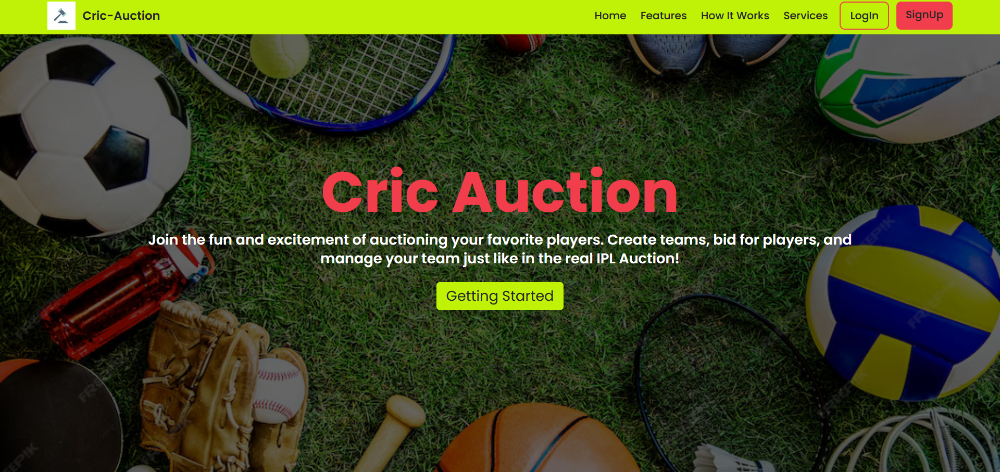

SignUp/SignIn
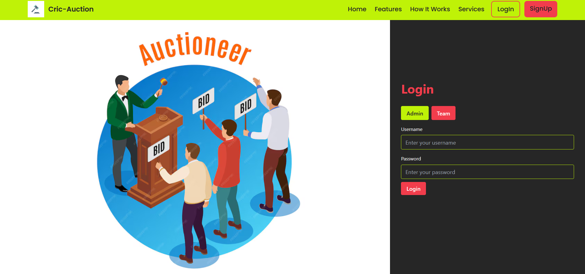

Dashboard
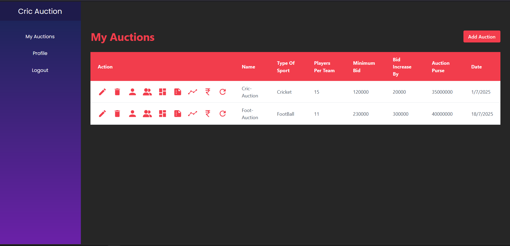

Auction Registration
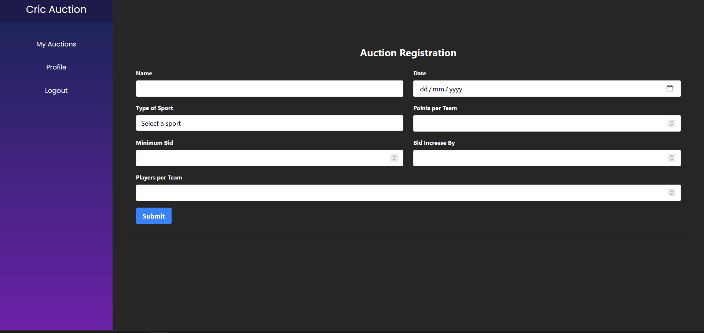

Player List
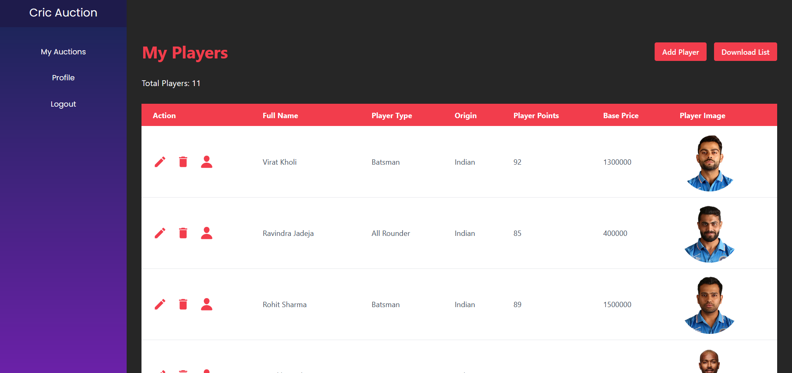

Player Registration
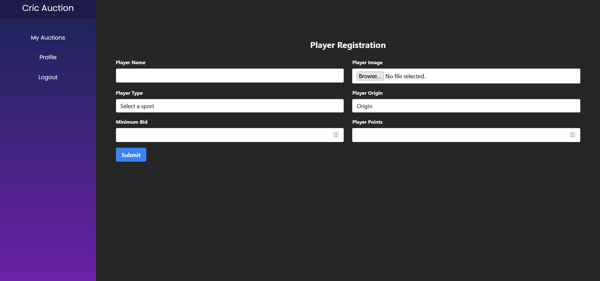

Team List
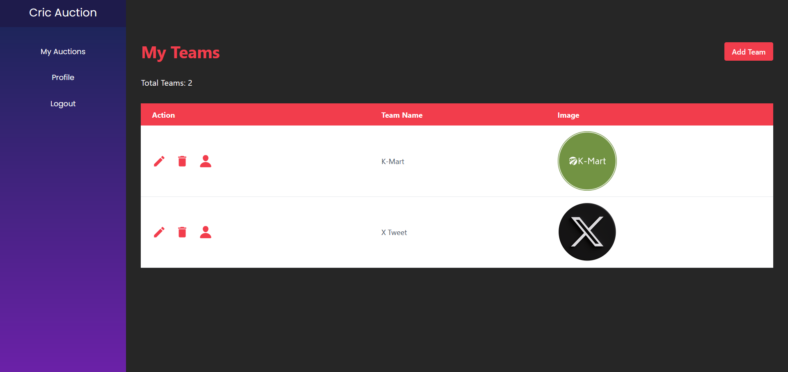

Team Registration
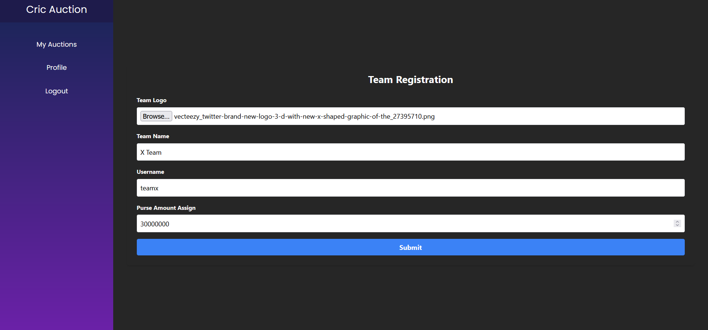

Auction
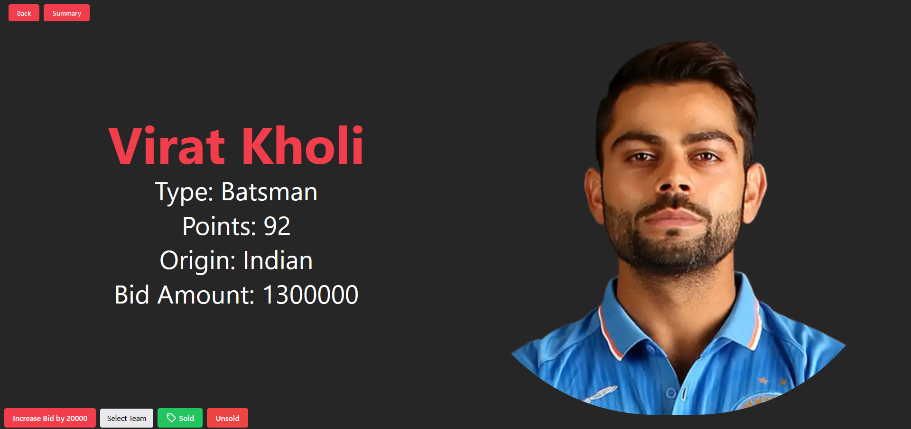

Team Summary
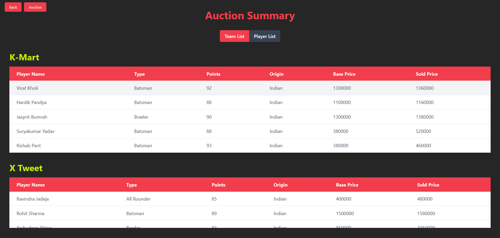

Player Summary
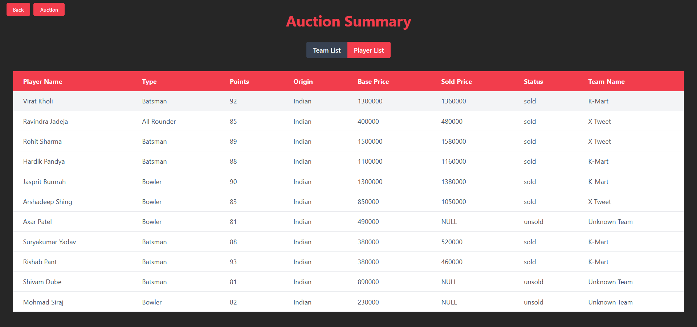


